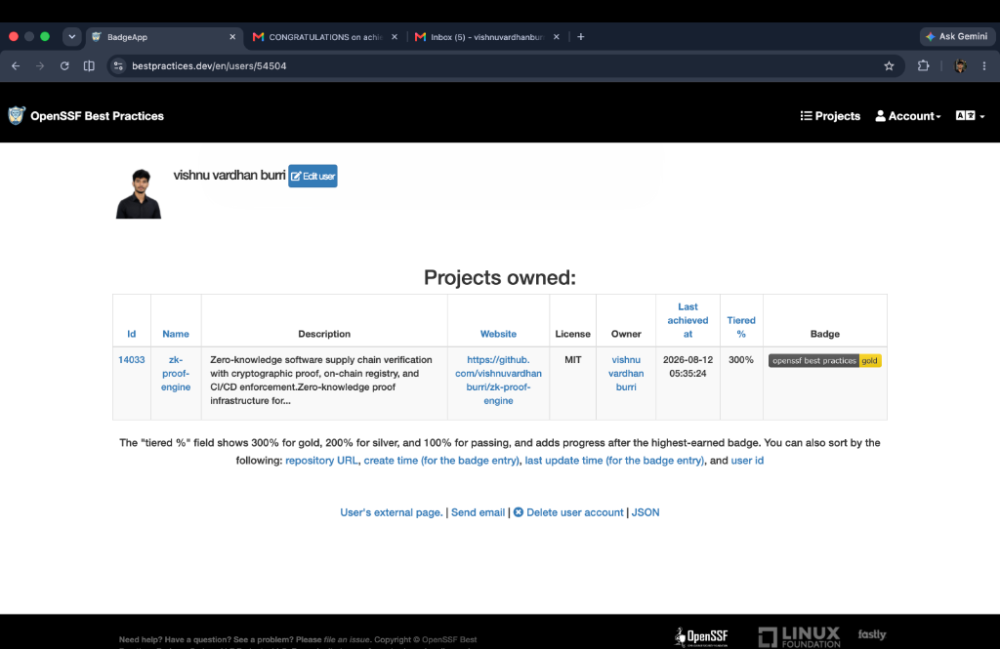

# zk-proof-engine

Zero-knowledge proof infrastructure for software supply-chain verification — cryptographic proof generation, offline and on-chain verification, append-only registry, artifact integrity binding, authenticated REST API, and CI/CD enforcement.

> **Security notice:** This project has **not undergone a formal third-party security audit.**
> Do not treat automated security controls as an audit or cryptographic certification.
> Review the [Security Model](#security-model), [Threat Model](THREAT_MODEL.md), and [Status & Limitations](#status--limitations) before production use.

<p align="center">

[](https://www.bestpractices.dev/en/projects/14033)
[](https://github.com/vishnuvardhanburri/zk-proof-engine/actions/workflows/ci.yml)
[](https://github.com/vishnuvardhanburri/zk-proof-engine/actions/workflows/codeql.yml)
[](https://github.com/vishnuvardhanburri/zk-proof-engine/actions/workflows/scorecard.yml)
[](https://github.com/vishnuvardhanburri/zk-proof-engine/releases)
[](LICENSE)

</p>

---

## Table of Contents

- [Overview](#overview)
- [Architecture](#architecture)
- [Security Model](#security-model)
- [Supply-Chain Security](#supply-chain-security)
- [Quick Start](#quick-start)
- [Development](#development)
- [Testing](#testing)
- [CI/CD](#cicd)
- [Cryptographic Design](#cryptographic-design)
- [Threat Model](#threat-model)
- [Release Integrity](#release-integrity)
- [Proof Verification](#proof-verification)
- [Proof Envelope](#proof-envelope)
- [Configuration](#configuration)
- [Status & Limitations](#status--limitations)
- [Roadmap](#roadmap)
- [Contributing](#contributing)
- [Security Policy](#security-policy)
- [Governance](#governance)
- [OpenSSF Best Practices](#openssf-best-practices)
- [License](#license)

---

## Overview

`zk-proof-engine` provides a complete zero-knowledge proof lifecycle for software supply chains:

```text
Circuit
   │
   ▼
Witness Generation
   │
   ▼
Groth16 Proof
   │
   ▼
Canonical Proof Envelope
   │
   ├──────────────► Offline Verification
   │
   ├──────────────► Artifact / VK Binding
   │
   ▼
Authenticated API
   │
   ▼
On-Chain Registry
   │
   ▼
Proof Gatekeeper (CI/CD enforcement)
```

The system enforces the software supply chain as a security boundary:

```text
Source
  │
  ├── Locked dependencies (npm ci + package-lock.json)
  ├── CodeQL static analysis
  ├── Secret scanning (Gitleaks)
  ├── Dependency vulnerability scanning (OSV)
  ├── Dependency review on pull requests
  └── Reproducible, signed releases (SLSA + Cosign)
```

**Versioning:** This project follows [Semantic Versioning 2.0.0](https://semver.org/).  
`MAJOR` — incompatible API or CLI changes.  
`MINOR` — backwards-compatible new functionality.  
`PATCH` — backwards-compatible bug and security fixes.

---

## Architecture

The system is organized as seven workspace packages, each with a distinct responsibility and trust boundary.

| Package | Responsibility | Boundary |
| --- | --- | --- |
| `circuit-lib` | circom circuits, compiled R1CS/WASM, verification keys | Offline, no network |
| `proof-format` | Canonical proof envelope types, serialization, `proofHash` | Library |
| `engine` | Witness generation, Groth16 prove/verify, key management | Library, CPU-intensive |
| `contracts` | Solidity verifier + append-only on-chain registry (Foundry) | EVM |
| `api` | Fastify REST API — HMAC auth, nonce/idempotency, rate limits, audit log | HTTP |
| `cli` | Developer CLI — `zk prove`, `verify`, `register`, `status`, `deploy` | TTY |
| `dashboard` | React proof-status explorer | Web |

Detailed architecture documentation: [ARCHITECTURE.md](ARCHITECTURE.md)  
Design decisions: [docs/adr/](docs/adr/)

---

## Security Model

Authentication uses **HMAC-SHA256** over a canonical request string including method, path, body hash, timestamp, and nonce. Requests outside a configurable timestamp window are rejected. Each nonce is consumed exactly once — backed by Redis in multi-replica deployments.

Tenant identity is derived server-side from the authenticated API key. Client-supplied tenant identifiers in request payloads are explicitly ignored.

Private inputs **never leave the proving agent**. The API receives only the public inputs and proof. The on-chain verifier is the source of truth for admitted proofs.

---

## Supply-Chain Security

| Control | Status |
| --- | --- |
| Gitleaks secret scanning | Configured — [`.gitleaks.toml`](.gitleaks.toml) |
| CodeQL static analysis | Configured — [`.github/workflows/codeql.yml`](.github/workflows/codeql.yml) |
| OSV vulnerability scanning | Configured — [`osv-scanner.toml`](osv-scanner.toml) |
| Dependabot | Configured — [`.github/dependabot.yml`](.github/dependabot.yml) |
| Dependency review | Configured on pull requests |
| OpenSSF Scorecard | Configured — [`.github/workflows/scorecard.yml`](.github/workflows/scorecard.yml) |
| SHA-pinned Actions | All workflow actions pinned to full commit SHA |
| Least-privilege permissions | Explicit `permissions:` block on every workflow |
| SBOM (CycloneDX) | Generated at release |
| SLSA Build Provenance | Generated via `actions/attest-build-provenance` at release |
| Sigstore / Cosign | Release artifacts signed and verifiable |
| `sha256sums.txt` | Checksums published alongside every release |
| CODEOWNERS | Configured |
| Workflow timeouts | Configured |

Automated controls provide continuous assurance; they are **not a substitute for an independent security audit**.

---

## Quick Start

**Requirements:** Node.js 22+, npm 10+, Foundry (`forge`, `anvil`).

```bash
# 1. Clone and install
git clone https://github.com/vishnuvardhanburri/zk-proof-engine.git
cd zk-proof-engine
npm ci
npm run build

# 2. Start a local Ethereum node (new terminal)
npm run dev:anvil

# 3. Deploy registry contract (new terminal)
npm run dev:deploy

# 4. Start the API server (new terminal)
npm run dev:api

# 5. Generate and verify a proof
cd packages/cli
npm run zk -- prove poseidon-preimage '{"preimage":"12345"}'
npm run zk -- register ./proof.json --idempotency-key "$(uuidgen)"
npm run zk -- status ./proof.json
```

---

## Development

```bash
# Install all workspace dependencies
npm ci

# Build all packages
npm run build

# Lint all packages
npm run lint

# Type-check all packages
npm run typecheck

# Run full test suite
npm test

# Validate everything
npm run check
```

### Smart Contracts

```bash
cd contracts
forge test
forge test --match-path "test/fuzz/*" --match-path "test/invariants/*"
```

### API (watch mode)

```bash
npm run dev -w packages/api
```

---

## Testing

Testing is layered across correctness, security, integration, and system boundaries.

| Test Layer | Tool | Purpose |
| --- | --- | --- |
| Unit | Vitest | Package-level correctness |
| Integration | Vitest | Cross-package and CLI behavior |
| Property / Fuzz | Vitest + `forge` | Boundary and invariant discovery |
| Smart-contract | Forge | Registry, verifier, gatekeeper |
| Negative | Vitest | Invalid proofs and bypass attempts |
| API security | Vitest | Authentication, replay, abuse |
| E2E | CI | Prove → verify → register → on-chain gate |
| Supply-chain | CI | Secrets, SAST, provenance |

Passing automated tests does not constitute a formal security audit.

---

## CI/CD

```text
Pull Request / Push
        │
        ├── Build & Test (Node 22, Ubuntu + macOS + Windows)
        ├── CodeQL
        ├── Gitleaks
        ├── OSV Scanner
        ├── Dependency Review
        ├── Smart Contract Tests (Foundry)
        ├── Gatekeeper Validation
        └── OpenSSF Scorecard

Tagged Release
        │
        ├── Artifact (zk-proof-engine-release.tar.gz)
        ├── SBOM (sbom.json — CycloneDX)
        ├── SHA-256 checksums (sha256sums.txt)
        ├── SLSA Build Provenance
        └── Sigstore / Cosign signatures
```

All workflows use explicit permissions and per-job timeout controls.

---

## Cryptographic Design

- **Proving scheme:** Groth16 over BN254 (EIP-196/197 standard EVM precompile curve)
- **Security level:** ~100 bits (BN254 NFS trade-off; documented in [THREAT_MODEL.md](THREAT_MODEL.md))
- **Circuits:** circom 2; `poseidon-preimage` and `merkle-inclusion` (production); `sha256-preimage` deferred
- **Trusted setup:** Development PTau; production requires a proper multi-party ceremony (see [docs/21-trusted-setup-plan.md](docs/21-trusted-setup-plan.md))
- **Verification keys:** Canonically hashed (`vkHash`); allow-listed server-side
- **Proof envelope:** Deterministic canonical serialization; stable `proofHash` across environments

Full cryptographic design rationale: [docs/12-crypto-design-review.md](docs/12-crypto-design-review.md) and [docs/adr/](docs/adr/)

---

## Threat Model

See [THREAT_MODEL.md](THREAT_MODEL.md) for the full threat model, including:

- Trust boundaries between prover, verifier API, and on-chain contracts
- Replay attack mitigations (nonce + timestamp + HMAC)
- Resource exhaustion mitigations (Semaphore, rate limits, Redis-backed nonce store)
- Tenant isolation enforcement (server-side identity, no client-supplied tenant IDs)
- Supply-chain attack surface and mitigations

---

## Release Integrity

Every tagged release includes machine-verifiable supply-chain metadata.

```bash
# Download release artifacts
gh release download v1.0.0-rc.2 \
  -R vishnuvardhanburri/zk-proof-engine

# Verify artifact digest
sha256sum --check sha256sums.txt

# Verify GitHub SLSA build provenance
gh attestation verify zk-proof-engine-release.tar.gz \
  -R vishnuvardhanburri/zk-proof-engine

# Verify Sigstore / Cosign signature
cosign verify-blob \
  --certificate-identity-regexp \
  "^https://github\.com/vishnuvardhanburri/zk-proof-engine/\.github/workflows/release\.yml@refs/tags/v.*$" \
  --certificate-oidc-issuer \
  "https://token.actions.githubusercontent.com" \
  --bundle release.sig \
  zk-proof-engine-release.tar.gz
```

The release identity is scoped to this repository's release workflow and version-tag execution context.

---

## Proof Verification

### Offline

```bash
zk verify proof.json --offline
```

Validates envelope integrity, verification-key binding, and Groth16 proof without network access.

### On-Chain Registration

```bash
zk register proof.json --idempotency-key "$(uuidgen)"
```

### Status Query

```bash
zk status proof.json
```

### Authenticated API

```bash
curl -X POST http://localhost:4000/v1/proofs/verify \
  -H "Content-Type: application/json" \
  -H "x-zk-client: <client-id>" \
  -H "x-zk-ts: <timestamp>" \
  -H "x-zk-nonce: <nonce>" \
  -H "x-zk-sig: <hmac-sha256>" \
  -d @proof.json
```

---

## Proof Envelope

### `zk-proof/v1`

Unsigned canonical proof envelope:

```text
formatVersion
circuitId
circuitVersion
vkHash
artifactHash
publicInputs
proof
proofHash
proverTimestamp
```

### `zk-proof/v2`

Adds Ed25519 signature over the canonical envelope:

```text
signature
├── algo
├── keyId
└── value
```

Canonical serialization is deterministic — hashes and signatures are stable across verification environments.

---

## Configuration

```bash
cp .env.example .env
```

| Variable | Description |
| --- | --- |
| `ZK_ENV` | Environment (`dev`, `staging`, `prod`) |
| `ZK_API_URL` | API base URL |
| `ZK_API_KEY` | HMAC signing key |
| `ZK_NETWORK` | Chain network (`dev`, `sepolia`, `mainnet`) |
| `ZK_RPC_URL` | EVM JSON-RPC endpoint |
| `ZK_REGISTRY_ADDRESS` | Deployed registry contract address |
| `ZK_REDIS_URL` | Redis URL (required for multi-replica deployments) |
| `ZK_LOG_LEVEL` | Log level (`debug`, `info`, `warn`, `error`) |

**Never commit credentials, private keys, API keys, or `.env` files.**

---

## Status & Limitations

### Security Audit

No formal third-party security audit has been performed. This is a stated prerequisite for a production deployment in adversarial environments.

### Trusted Setup

Development builds use the project's development PTau. A production deployment requires a proper multi-party trusted setup ceremony per [docs/21-trusted-setup-plan.md](docs/21-trusted-setup-plan.md).

### Multi-Replica Deployments

Single-instance deployments use in-memory state for idempotency, nonces, and job queuing. Horizontal scaling requires `ZK_REDIS_URL` to be configured, which activates the Redis-backed adapters for authoritative distributed state.

### Maintainer Model

This project is currently maintained by a single maintainer. This is documented in [GOVERNANCE.md](GOVERNANCE.md). The bus factor and two-person review requirement are explicitly listed as unmet in [GOLD-GAP-REPORT.md](GOLD-GAP-REPORT.md).

**Maintainer:** Vishnu Vardhan Burri — [@vishnuvardhanburri](https://github.com/vishnuvardhanburri)

### Cryptographic Security Level

BN254 provides approximately 100 bits of security. This is the standard EVM pairing precompile curve and is accepted as a production trade-off. See [THREAT_MODEL.md](THREAT_MODEL.md).

---

## Roadmap

See [ROADMAP.md](ROADMAP.md) for the complete 12–18 month plan.

**Completed:**
- Groth16 / BN254 proof engine (`circuit-lib`, `engine`)
- Canonical proof envelopes (`proof-format`)
- Authenticated Fastify REST API with HMAC auth, nonces, idempotency, rate limits (`api`)
- On-chain registry and verifier contracts (Foundry)
- Developer CLI (`cli`)
- CI/CD gatekeeper workflow (`.github/`)
- Redis-backed distributed state adapters (`api`)
- SLSA Build Provenance, Sigstore signatures, SBOM (`release.yml`)
- OpenSSF Best Practices Gold badge

**In Progress:**
- Production trusted setup ceremony

**Planned (2026–2027):**
- Mainnet contract deployment
- Plonk / Halo2 universal setup integration
- GPU-accelerated proving
- Privacy-preserving proof delegation

---

## Contributing

See [CONTRIBUTING.md](CONTRIBUTING.md) for contribution guidelines, code style, and the DCO requirement.

All contributors must sign off commits with `git commit -s` in accordance with the [Developer Certificate of Origin](DCO.md).

---

## Security Policy

Report vulnerabilities privately through [GitHub Security Advisories](https://github.com/vishnuvardhanburri/zk-proof-engine/security/advisories/new).

**Do not open public issues for security vulnerabilities.**

See [SECURITY.md](SECURITY.md) for the full disclosure process and known accepted risks.

---

## Governance

Roles, responsibilities, access continuity, and bus-factor documentation: [GOVERNANCE.md](GOVERNANCE.md)

Code of Conduct: [CODE_OF_CONDUCT.md](CODE_OF_CONDUCT.md)

---

## OpenSSF Best Practices

This project has achieved the **OpenSSF Best Practices Gold** badge, the highest tier of the [OpenSSF Best Practices program](https://www.bestpractices.dev/).

[](https://www.bestpractices.dev/en/projects/14033)

**Project ID:** [14033](https://www.bestpractices.dev/en/projects/14033)  
**Tiered score:** 300% (Gold)  
**Last achieved:** 2026-08-12

The Gold badge reflects verified compliance across governance, documentation, security, cryptographic design, testing, CI/CD, and supply-chain integrity criteria.

For the full gap analysis against Gold criteria, including honestly documented unmet criteria such as bus factor and independent audit, see [GOLD-GAP-REPORT.md](GOLD-GAP-REPORT.md).

<a href="https://www.bestpractices.dev/en/projects/14033">
  
</a>

*Screenshot of the official OpenSSF Best Practices project page showing Gold status for `zk-proof-engine` (Project ID 14033).*

---

## License

MIT License. See [LICENSE](LICENSE).
