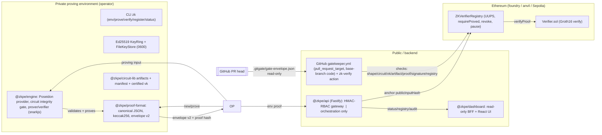

# Architecture — Current System (as built, 2026-08-09)

Verified against the working tree, tests, and gates (`npm run check` 11/11,
forge 43 tests + snapshot, dashboard smoke 15/15). This document reflects the
repository as it exists now, including uncommitted M9 work in
`packages/dashboard/`.

## 1. Purpose / scope

Maps the implemented system end-to-end: private proving environment →
canonical proof format → signing keys → API → on-chain registry → CI
gatekeeper → dashboard observability. Each layer card captures the trust
boundary and the source of truth for serialization semantics.

## 2. System flow (who calls whom)

## 3. Components (purpose / inputs / outputs / boundary)

### 3.1 @zkpe/proof-format — canonicalization & binding
- **Purpose:** single source of truth for serialization: canonical JSON
  (RFC 8785 subset), keccak256/sha256 helpers, envelope v1/v2, manifest,
  ABI-compatible `publicInputHash`.
- **Inputs:** proof public inputs (decimal `Fr`), circuit id, artifact bundle
  hash. **Outputs:** envelope `proofHash`, `vkHash`, `circuitId` → `bytes32`,
  `publicInputHash = keccak256(abi.encode(uint256[]))`. (`artifactHash` is the
  envelope's sha256 of the artifact bundle — circuit implementation, not
  application provenance — docs/09 §6.)
- **Security boundary:** byte-identical hashes are required by the contract
  (`canonical-vectors.json` pinned in both TS `abi.test.ts` and Solidity
  `CanonicalHash.t.sol`).

### @zkpe/circuit-lib — circuits & artifacts
- v1 implemented set (ADR-0008 amendment 1): `poseidon-preimage` (240
  constraints), `merkle-inclusion` (974 constraints), both v1.0.0; dev PTau16
  deterministic, keygen, certification manifest with committed artifact
  hashes; `checkArtifacts` gate. (No SHA-256 circuit in v1 — `sha256.circom`
  miscompiles on the pinned toolchain; deferred, docs/13 §3.)
  **Boundary:** never alters proof semantics after certification; artifacts
  are content-addressed.

### @zkpe/engine — proving/verification
- `Circuit` handle verifies integrity (sha256 of artifacts) before load;
  snarkjs 0.7.6 prover/verifier; `HashProvider` interface with Poseidon
  reference (bit-for-bit vs plain JS oracle in tests); `TaskRecord` audit
  journal; dev keygen. **Boundary:** verification key hash is the trust root —
  `verify()` requires vkHash match.

### @zkpe/keys — identity & signing
- Ed25519 signing (noble), keyId = SHA-256 thumbprint of canonical public JWK,
  key rotation, retention, FileKeyStore 0600, envelope sign/verify with
  format-version binding (downgrade immpossible). **Boundary:** private key
  material never leaves the keyring store.

### @zkpe/api — REST gateway (orchestration only)
- Fastify 5; HMAC-SHA256 request signatures (`x-zk-*` headers, nonce replay
  store, 300s TTL); RBAC roles (read / submit / write / audit from
  `ZK_API_KEYS`); idempotency-key register with per-key single-flight; token
  bucket rate limiters; Zod schemas; RFC 9457 error codes; OTel; Prometheus
  `/v1/metrics`; audit journal; delegates all crypto to engine / proof-format;
  ChainAdapter talks to the registry (pi_b swap for Fp2). **Boundary:** the API
  is stateless — no persistence except in-memory stores; it must never sign or
  prove.

### @zkpe/cli — zk binary
- Orchestrates env, prove, verify, register, status, registry, deploy,
  completions; exit codes 0/1/2; `--json`; secrets redacted; reuses api client
  `signedFetch` (keeps HMAC implementation in one place). **Boundary:**
  command-line convenience only — delegation, no re-implementation.

### @zkpe/dashboard (M9, uncommitted) — read-only observability
- Vite + React (18), Fastify BFF with HashedSession cookie (HMAC
  `zkdash v1.expiry.hmac`, HttpOnly, SameSite=Lax), CSP, no-js headers, 8
  get-only routes; wraps `@zkpe/api` ApiClient (the only other HMAC client);
  reads gate reports from `data/gatekeeper` (FsGateStore). 13 vitest tests +
  smoke (15 checks) green. **Boundary:** no POST anywhere; no chain exposure.

### contracts/ — registry & verifier (Foundry 1.7.1)
- `ZKVerifierRegistry`: Groth16 registry (UUPS, schema 1), `requireProved`,
  `revokeProof` (permanent), pausable, append-only proof anchors,
  GatedConsumers (allowlist of caller apps), `UpgradeAndPause` demo. 43 tests
  (incl. fuzz + invariant), gas snapshot pinned. **Boundary:** on-chain state is
  the final arbiter of "proved".

### .github/workflows/gatekeeper.yml — merge gate
- `pull_request_target`, runs trusted (base-branch) workflow + `zk-verify`
  action; reads only `.gitgate/gate-envelope.json` from PR head (read-only
  checkout). 7 checks (shape/circuit/certified vk/allowlist/artifactHash/
  proof verify/signature + require-sign provenance on-chain). Fails closed (no
  key → fail). `gate-negative` job reruns 15-case negative suite.

## 4. Trust boundaries

1. Private proving env ↔ API: only public inputs + envelope cross; witnesses
   never travel.
2. Operator signatures: key material stays in keyring.
3. CI gate: base-branch code wins; PR code never executes trusted steps.
4. On-chain: registry is source-of-truth for proof state at enforcement time.
5. Dashboard: read-only; does not hold keys for the API or chain.

**What this system does NOT prove** (docs/09 §2.2, doc 19): no source→binary
claim — the v1 proofs attest only the two implemented relations; `artifactHash`
(sha256 of the circuit r1cs/wasm/zkey/vk bundle) is circuit-artifact binding,
not application-binary provenance; source→binary would be a new circuit + a
future milestone (docs/09 §7.3).

## 5. Data flows worth documenting

- **Register flow:** `zk register` → API `POST /v1/proofs/register`
  (Idempotency-Key, HMAC) → adapter submits to `ZKVerifierRegistry` → status
  readable at `GET /v1/proofs/status/:circuitId/:publicInputHash`.
- **Gate flow:** PR → gatekeeper.yml → `.gitgate/gate-envelope.json` →
  engine verify (certified vk) → registry state check → merge decision.
- **Observability flow:** API audit ring (1024) → CLI/API `audit`; gate reports
  → `data/gatekeeper/*.json` → dashboard BFF (`/api/gatekeeper`) → UI.

## 6. Known deltas vs. docs (status 2026-08-09)

Resolved in release preparation (commit pending):

1. `docs/20` test-plan section rewritten to match the colocated tests + repo smoke.
2. `docs/20` `UI_ALLOWLIST` — marked "(planned; not implemented)".
3. dashboard `package.json` `main`/`types`/`start`/`smoke` aligned to the
   `dist/server/server/…` layout; `tsconfig.build.json` emits server+shared only.
4. `forge fmt --check` drift — fixed via `forge fmt` (`ProofGatekeeper.sol`
   + 4 contract files); check green.
5. Root README status corrected (M0–M8 complete, M9 in working tree).
6. Demo gatekeeper fixtures normalized to `poseidon-preimage@1`; blocked
   fixture's `file` field fixed.

---
Sources verified: package sources + tests, contracts/ (forge), workflows,
CHANGELOG, ADR-0005/0008/0009/0010/0011/0012, docs/13, scripts e2e. Personal
data: none.